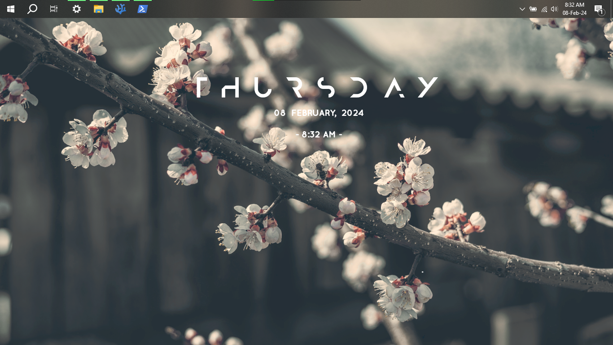

<h1 align=center> Rainmeter Config </h1>

A Rainmeter config for mond package. Make sure to have `mond.rmskin` installed in order to make it work.

For manual installation, clone this repo to `C:\Users\userName\Documents\Rainmeter\Skins`.

For command installation, `git clone https://github.com/SidonTheTroll/rainmeter-config --depth 1 C:\Users\userName\Documents\Rainmeter\Skins\mond`

